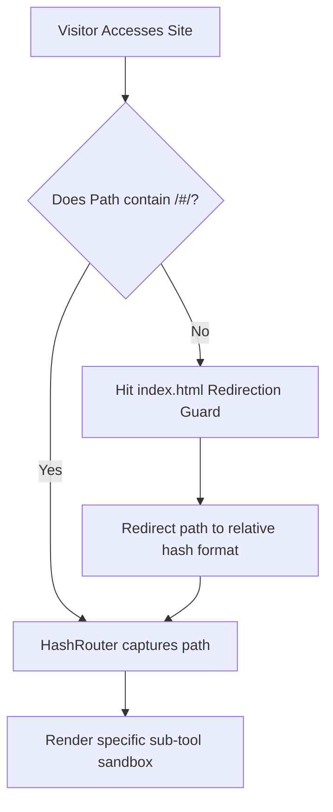

# 📖 ToolTrove Platform - Master Usage & Logic Skill File

This master skill file details the comprehensive technical architecture, runtime logic, routing design, and operational workflows of the **ToolTrove** platform. Use this as a reference checklist or guide when modifying components or understanding how tools function.

---

## 🏛️ 1. Core Architecture Design

ToolTrove is built as a state-of-the-art, high-performance, single-page application using modern web technologies:

| Technology | Purpose | Key Benefits |
| :--- | :--- | :--- |
| **React (v19)** | UI Rendering & Reactive State | Seamless virtual DOM rendering, hooks-first logic, and component modularity. |
| **Vite (v8)** | Build System & HMR | Lightning-fast development server, asset bundling, and hash-less production builds. |
| **TailwindCSS (v3)**| Utility-First Styling | Premium glassmorphism UI, custom HSL gradients, and fully responsive layouts. |
| **Framer Motion** | Micro-Animations | Smooth dynamic transitions, hovering cards, and premium loading states. |

---

## 🔒 2. "Client-Side First" Operational Philosophy

A fundamental pillar of ToolTrove is **absolute user privacy and security**. 

> [!IMPORTANT]
> **Zero-Server Buffer**: 100% of all utility operations, parsing, formatting, calculations, and conversions happen **entirely inside the user's browser sandbox** using local resources (CPU, GPU, and WebGL). No files, documents, passwords, or private input values are ever transmitted over external networks.

### Major Local Processing Pipelines:
1. **Document Tools (PDFs)**: Operates using browser-bound canvas engines to split, merge, compress, and render PDF pages in real-time.
2. **Media Tools (Background Remover)**: Leverages hardware-accelerated **WebGL alpha-masking** channels directly on the client's GPU (`Math.max(r, g, b, a)`) to isolate foreground subjects from raster images.
3. **Security Tools (Password / Hash Generator)**: Utilizes the browser's cryptographically secure **Web Crypto API** to compute hashing sequences and passwords locally.
4. **Calculators (Amortization / GST)**: Executes math structures and dynamically compiles graphical SVGs for amortization charts instantly.

---

## 🗺️ 3. Routing & GitHub Pages Architecture

GitHub Pages is a static hosting platform. To ensure complex nested sub-routes (like `/tools/media/Background%20Remover`) don't throw standard web server 404s when refreshed, ToolTrove implements a robust **HashRouter** strategy.



### Key Integration Points:
- **HashRouter Implementation**: Located in [src/App.jsx](file:///d:/Tool%20trove/src/App.jsx). Wraps the master UI in a `#` routing layout.
- **Redirection Guard**: Injected in the root `index.html` to automatically forward requests to compiled `/dist/index.html` assets.
- **Vite Config Asset Base**: Set to `/Tool-Trove/` with compiled hash-less scripts inside the [vite.config.js](file:///d:/Tool%20trove/vite.config.js) configuration, enabling seamless Relative Chunk Resolution.

---

## 🎨 4. Unified Branding & AI Coprocessor Logic

The brand identity fuses high-tech utility with artificial intelligence:

```
                  ┌───────────────────────────────┐
                  │      Unified Wrench Logo      │
                  │   (Spanner + AI Sparkle)      │
                  └───────────────┬───────────────┘
                                  │
         ┌────────────────────────┼────────────────────────┐
         ▼                        ▼                        ▼
┌─────────────────┐      ┌─────────────────┐      ┌─────────────────┐
│  Brand Identity │      │  AI Coprocessor │      │   Sandbox Actions │
│ (Header/Footer) │      │  Active Badges  │      │ (Compute Button)│
└─────────────────┘      └─────────────────┘      └─────────────────┘
```

- **Logo Geometry**: The brand icon (`LogoIcon` in `BrandLogo.jsx`) is a custom-coded premium vector. It displays a sleek spanner wrench head (representing a manual utility tool) holding a glowing 4-point golden/white AI sparkle star (representing next-gen smart coprocessor acceleration) inside an isometric digital vault shield.
- **AI Badges**: Any tool marked as an **AI Coprocessor** (such as dynamic translators, copywriters, or checkers) displays a pulsing version of the `LogoIcon` next to it rather than generic processor hardware icons, maintaining professional visual consistency.

---

## 📂 5. Directory Structure & Key Files

For rapid development and onboarding, here is the functional map of the repository:

- 📄 [src/App.jsx](file:///d:/Tool%20trove/src/App.jsx): The master shell container. Houses routing, main navigation headers/footers, homepage grid layouts, tool category lists, and the sandbox renderer.
- 📂 [src/components/](file:///d:/Tool%20trove/src/components/):
  - 📄 [BrandLogo.jsx](file:///d:/Tool%20trove/src/components/BrandLogo.jsx): Houses `LogoIcon` and `BrandLogo` components.
  - 📄 [ChatAssistant.jsx](file:///d:/Tool%20trove/src/components/ChatAssistant.jsx): The simulated AI console sandbox showing autotyped client compiling outputs.
  - 📄 [Mascots.jsx](file:///d:/Tool%20trove/src/components/Mascots.jsx): SVG vectors of the ToolTrove guardians (Owl, Lion, Elephant, Chameleon, Fox).
  - 📄 [SEOManager.jsx](file:///d:/Tool%20trove/src/components/SEOManager.jsx): Sets descriptive titles, meta descriptions, and structural tags dynamically for search crawlers.
- 📂 [src/tools/](file:///d:/Tool%20trove/src/tools/):
  - 📄 [DocumentTools.jsx](file:///d:/Tool%20trove/src/tools/DocumentTools.jsx): Codebase for PDF compressors, splitters, merges, text extractors, etc.
  - 📄 [MediaTools.jsx](file:///d:/Tool%20trove/src/tools/MediaTools.jsx): Implementation file for Background Remover, QR Generator, meme tools, and croppers.
  - 📄 [CalculatorTools.jsx](file:///d:/Tool%20trove/src/tools/CalculatorTools.jsx): High-fidelity financial SIP, GST, and amortization calculators.
  - 📄 [SecurityTools.jsx](file:///d:/Tool%20trove/src/tools/SecurityTools.jsx): Developer-oriented local hashing validators and secure password generators.
